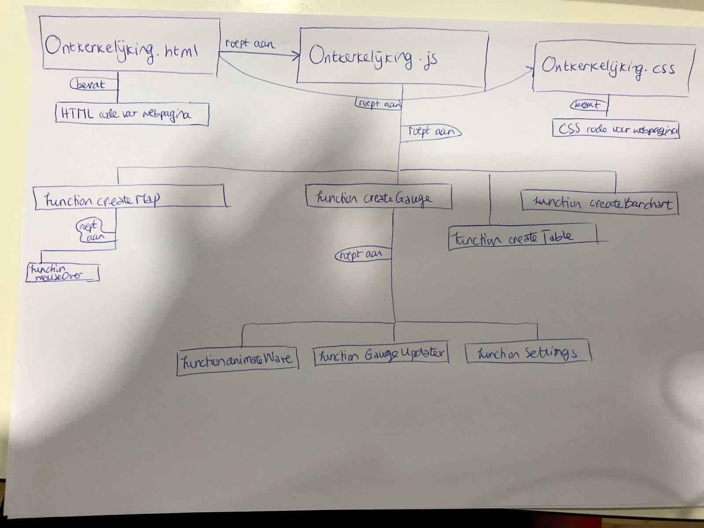

# Design doc

Bron
----

Voor mijn project gebruik ik louter data van het Centraal Bureau voor de Statistiek, die te vinden zijn op www.cbs.nl. De data download ik hiervandaan in CSV format en zal ik met behulp van een zelfgeschreven functie converteren naar JSON format. Met deze laatste heb ik veel gewerkt tijdens Data Processing en daarom vind ik dit een prettig format om ook nu te gebruiken. 

Diagram met overzicht technische componenten
---------------------------------------------

Ik heb een diagram gemaakt met de technische componenten van mijn project en hoe deze met elkaar verbonden zijn:

* JavaScript files: 
	- barchart.js
	- gauge.js
	- map.js
	- table.js
* HTML file: ontkerkelijking.html
* CSS file: ontkerkelijking.css

In de JavaScript file staan de volgende functies:
* Functie om de kaart te maken: function createMap
	- functie voor de *hover* met de muis: function mouseOver
	- ...

* Functie om de *liquid fill gauge* te maken: function createGauge
	- functie voor de golving: function animateWave
	- functie die de *gauge* update: function gaugeUpdater
	- functie met de instellingen voor de *gauge*:  function Settings

* Functie om de tabel te maken: function createTable

* Functie om de *bar chart* te maken: function createBarchart

Lijst van API's of D3 plugins
------------------------------
* D3.js (http://d3js.org/d3.v3.min.js)
* d3-tip (http://labratrevenge.com/d3-tip/javascripts/d3.tip.v0.6.3.js)
